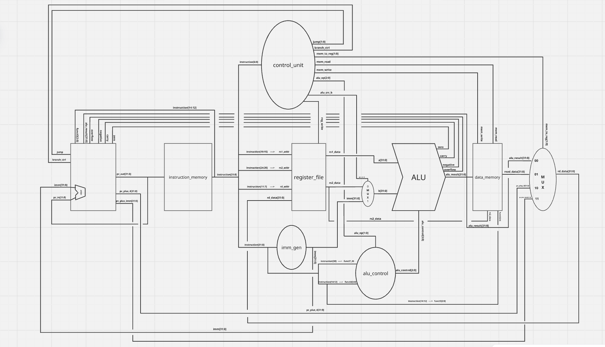

# RISC-V CPU

A RV32I RISC-V processor implementation written in SystemVerilog.

## Status

Single-cycle implementation complete and verified in simulation. Successfully synthesized to a Boolean board FPGA with working board peripherals. Pipelined implementation complete and verified in simulation against the full test suite. Currently implementing gshare dynamic branch prediction.

## Architecture

### Single-Cycle (Complete)

Link to more interactive [Miro Board](https://miro.com/app/board/uXjVHM7kwYA=/?share_link_id=328386992955)

**Core modules** (`rtl/single_cycle/`):

- `cpu_top.sv` — top-level integration of all core modules
- `ALU.sv` — arithmetic and logic operations
- `alu_control.sv` — generates ALU operation select from instruction fields
- `control_unit.sv` — decodes opcodes and generates datapath control signals
- `register_file.sv` — 32 x 32-bit register file
- `imm_gen.sv` — immediate value generation and sign-extension for all RV32I formats
- `instruction_memory.sv` — ROM loaded from `.mem` file via `$readmemh`
- `data_memory.sv` — byte-addressable RAM for load/store instructions
- `program_count.sv` — PC register with branch/jump support
- `riscv_pkg.sv` — shared constants and type definitions

**Board peripherals** (`rtl/board/`):

- `board_top.sv` — top-level for FPGA synthesis; connects CPU to board I/O
- `clock_div.sv` — divides 100 MHz board clock to other frequencies
- `detect_and_debounce.sv` — button debouncer for manual clock stepping
- `hex_display_4.sv` — drives 4-digit 7-segment display
- `hex_encode.sv` — encodes a 4-bit nibble to 7-segment segments
- `rgb_pwm.sv` — PWM controller for the onboard RGB LED

## Testing

CPU-level tests are written as RV32I assembly `.S` files, assembled with the riscv-gnu-toolchain, converted to `.mem` files via `s_to_mem.py`, and loaded into instruction memory. Each test writes `1` to `x3` on pass or a nonzero error code on fail. Test programs were generated with Claude Sonnet 4.6.

All RV32I instructions are covered across the test suite (`tests/src/`):

- `test_alu.S` — arithmetic and logic instructions
- `test_branches.S` — branch instructions
- `test_loads_stores.S` — load and store instructions
- `test_jalr.S` — jump instructions (`JAL`, `JALR`)
- `test_claude_comprehensive_1.S` — broad integration test
- `test_rgb.S` — RGB peripheral demo program

Each core module also has a standalone testbench (`tb/single_cycle/`).

## Pipeline (Complete)

Full 5-stage pipeline: Fetch, Decode, Execute, Memory, Writeback.

Link to [Miro Board](https://miro.com/app/board/uXjVHBKY5Pg=/?share_link_id=295366368027)

**Core modules** (`rtl/pipelined/`):

- `cpu_top.sv` — top-level integration with pipeline registers
- `program_count.sv` — PC register; accepts `next_pc`, `stall`, and `redirect` inputs
- `next_pc_unit.sv` — combinational; computes branch/jump targets and asserts `redirect`
- `forwarding_unit.sv` — detects EX/MEM and MEM/WB data hazards; selects forwarding path
- `hazard_unit.sv` — detects load-use hazards; asserts `stall`
- `control_unit.sv` — decodes opcodes and generates datapath control signals
- `register_file.sv` — 32 x 32-bit register file with write-through bypass
- `ALU.sv`, `alu_control.sv`, `imm_gen.sv`, `instruction_memory.sv`, `data_memory.sv` — shared with single-cycle

**Hazard handling:**

- Data hazards: EX/MEM→EX and MEM/WB→EX forwarding; register file write-through for 3-instruction gap
- Load-use hazards: 1-cycle stall inserted by hazard unit
- Control hazards: branch and jump resolved in EX with 2-cycle flush; gshare dynamic prediction in progress
