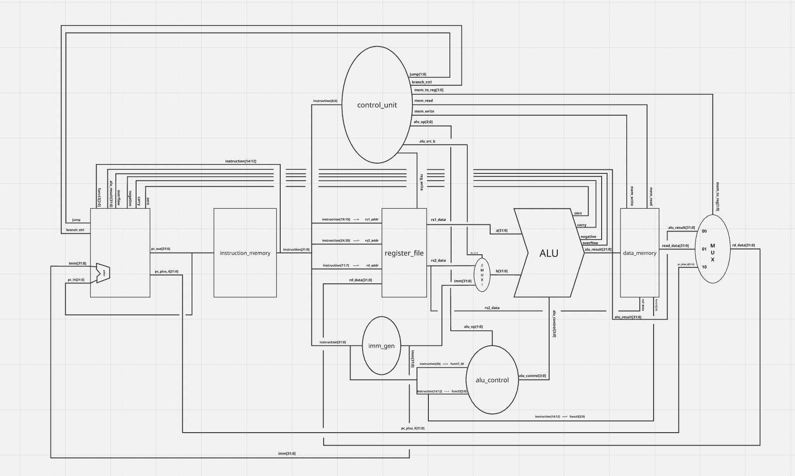

# RISC-V CPU
 
A RV32I RISC-V processor implementation written in SystemVerilog. Work in progress. Core datapath complete, still working on verification.
 
## Status
 
Modules implemented with passing testbenches:
 
- ALU
- ALU Controller
- Register File
- Immediate Generator
- Instruction Memory
- Data Memory
- Control Unit
- Program Count
- CPU Top (in progress)
  
Each module has a corresponding testbench for simulation-based verification.
Currently verifying full RV32I instruction set in simulation (cpu_top module and its testbench).
Not yet synthesized to hardware.

## Architecture

Link to more interactive
[Miro Board](https://miro.com/app/board/uXjVHM7kwYA=/?share_link_id=328386992955)
 
## Planned
 
Full pipeline integration (fetch, decode, execute, memory, writeback). First goal is a complete single-cycle implementation.
